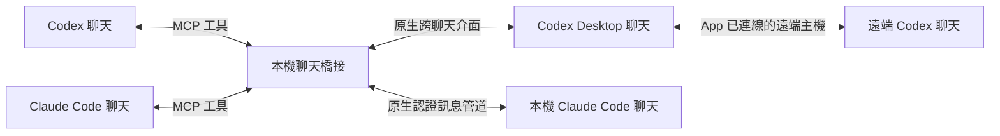

# Cross-model Chat Bridge

繁體中文 · [English](docs/README.en.md)

讓 **Codex 與 Claude Code 接上對方的原生跨聊天介面，互相傳訊息與接收回覆**，省去人工轉貼。

這個本機 MCP 提供雙方的聊天列表、歷史讀取與傳訊工具。Claude 可以請 Codex 處理工作，Codex 也能傳訊給正在執行的 Claude Code 聊天。Codex 已連線的遠端聊天也可使用，例如另一台 Mac 上的 Codex。

適合已在使用兩個工具、希望它們協調工作的開發者。目前橋接執行於 Windows，沒有額外 npm 套件依賴。



## 能做什麼

| 功能 | Codex | Claude Code |
|---|---|---|
| 找到其他聊天 | 原生近期、釘選與封存清單 | 本機主聊天、子代理與已保存歷史 |
| 讀取聊天 | 原生回合，可分頁；可能是摘要或截斷輸出 | 可見訊息與工具輸入／結果，可分頁 |
| 傳送訊息 | 可存取的聊天，含已連線的遠端主機 | 既有、正在執行的精確 session |
| 取得回覆 | 等待本次工作的最終答覆 | 同一 MCP 程序的 inbox 中的原生回覆／回執 |

## 開始使用

需要 Windows、Node.js 20 以上、正在執行的 Codex Desktop，以及要收訊息的 Claude Code 聊天。兩端必須允許使用此 MCP；安裝橋接本身不會替你開啟客戶端工具或授權。

1. 下載或 clone 本專案，從專案目錄確認環境：

   ```powershell
   node --version
   node src/cli.mjs --help
   ```

2. 從實際授權橋接的 Codex 聊天取得來源聊天 ID 與當次 `CODEX_APP_TOOLS_PIPE_PATH`。用同一份設定啟動兩端的 MCP，範例：[Claude](examples/claude-mcp.example.json)、[Codex](examples/codex-mcp.example.toml)。**接線、設定位置及取得參數的方法見 [安裝與使用](docs/usage.md)。**

3. 接線後先列出聊天，再對自己選定且授權的目的聊天傳訊。Claude 端用 `codex_request` 等待 Codex 回覆；Codex 端用 `claude_send_message`，再以 `claude_read_inbox` 查看回覆。

範例 MCP 啟動命令（須替換占位值）：

```powershell
node src/mcp-server.mjs --owner-thread "YOUR_CODEX_OWNER_THREAD_ID" --pipe "YOUR_CURRENT_CODEX_PIPE_PATH"
```

MCP 由客戶端管理 stdin/stdout；單獨啟動以上命令會等待協定輸入，沒有開啟聊天視窗。亦可使用 [CLI 或原生 callback 路由](docs/usage.md#cli-與原生-callback)，供 shell 或 Claude 的原生 `SendMessage` 呼叫。

## 如何判斷是否成功

| 狀態 | 代表什麼 |
|---|---|
| `accepted` | Codex 原生工具接受了派送，還沒有確認工作完成。 |
| `submitted_unconfirmed` | 訊息已寫入 Claude 原生管道，尚未確認對方收到。 |
| `completed` | 已觀察到精確對應本次 Codex 工作的完整最終答覆；不替答覆中的結論背書。 |
| `pending` | 此 MCP 程序的 Claude inbox 尚無符合查詢的訊息。 |
| `failed` / `unknown` | 未成功，或已派送但結果無法確認。先查看目的聊天，再決定是否補送。 |

逾時、斷線及不完整回覆都不會觸發自動重送。Claude 回覆的來源 session 可核對，但一般回覆未必能精確對應某次請求。

## 使用前須知道

- 使用雙方內部介面，版本更新可能改變管道或格式；Codex App 重啟後要更新管道設定。曾驗證的原始版本：Codex Desktop `26.1002.7124.0`、Claude Code `2.1.289`；這不是所有版本的相容保證。
- Claude 端目前涵蓋本機 Claude Code；其他裝置的 Claude 與 Claude App 尚未連線。已停止的聊天可以讀歷史，不能直接傳訊。
- 聊天內容與工具輸入／結果會保留可見原文，**不會自動遮罩正文中的秘密**。僅排除隱藏 thinking、內部事件與獨立認證檔。請只接給受信任的客戶端。
- 每個 MCP 客戶端啟動自己的程序；Claude inbox 只存在當次程序、最多保留 1000 件。需要回覆時保持同一連線。
- 來源標籤保留外部代理身分。傳訊仍需使用者授權；工具不改帳戶、權限或對端審查結果。使用上也須遵守對端產品條款。

完整設定、參數、信任邊界與排錯請見 [使用說明](docs/usage.md)、[介面與限制](docs/interfaces.md)及[安全政策](.github/SECURITY.md)。

## 開發與授權

```powershell
npm test
```

自動測試透過外部原生管道與聊天資料替身，執行正式 CLI、MCP 及路由程式；不需要帳戶，不會呼叫模型。它們驗證資料交接與錯誤處理，無法取代真實客戶端、跨機及長時間使用的驗收。[貢獻方式](.github/CONTRIBUTING.md)另說明選用的真模型往返測試。

採用 [MIT License](LICENSE)。本專案為獨立工具，與 OpenAI、Anthropic 無官方關聯。
