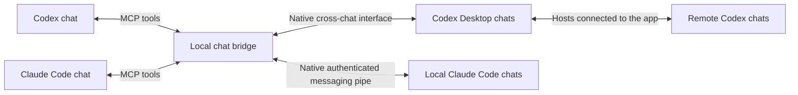

# Cross-model Chat Bridge

[繁體中文](../README.md) · English

Connect **Codex and Claude Code to each other's native cross-chat interfaces to exchange messages and replies**, without manually copying between chats.

This local MCP server exposes chat discovery, history reading and messaging for both tools. Claude can ask Codex to work on a task, and Codex can message a running Claude Code session. Codex chats on hosts already connected to the desktop app, including a remote Mac, are also accessible.

For developers already using both tools who want them to coordinate work. The bridge currently runs on Windows and has no additional npm dependencies.



## Features

| Feature | Codex | Claude Code |
|---|---|---|
| Discover chats | Native recent, pinned and archived lists | Local parent chats, subagents and saved histories |
| Read chats | Paginated native turns, which may be summarized or truncated | Paginated visible messages and tool inputs/results |
| Send messages | Accessible chats, including connected remote hosts | An exact existing live session |
| Receive replies | Wait for the final answer to this specific request | Read native replies/receipts from this MCP process's inbox |

## Getting started

Requires Windows, Node.js 20 or later, a running Codex Desktop app and a running Claude Code chat to receive messages. Both clients must allow this MCP server; installing the bridge does not enable their tools or grant permission.

1. Download or clone this project. From its directory, check:

   ```powershell
   node --version
   node src/cli.mjs --help
   ```

2. Obtain the owner chat ID and current `CODEX_APP_TOOLS_PIPE_PATH` from the Codex chat that authorized the bridge. Configure both clients using the [Claude](../examples/claude-mcp.example.json) and [Codex](../examples/codex-mcp.example.toml) examples. See [setup and usage](usage.md) for configuration locations and obtaining these values.

3. List chats first, then message a destination selected and authorized by the user. From Claude, use `codex_request` to wait for Codex's answer. From Codex, use `claude_send_message`, then `claude_read_inbox` for replies.

Example server command, after replacing the placeholders:

```powershell
node src/mcp-server.mjs --owner-thread "YOUR_CODEX_OWNER_THREAD_ID" --pipe "YOUR_CURRENT_CODEX_PIPE_PATH"
```

The MCP client manages stdin/stdout. Running this command alone waits for protocol input; it does not open a chat window. [CLI and native callback routing](usage.md#cli-與原生-callback) are also available for shell callers or Claude's native `SendMessage`.

## Delivery states

| State | Meaning |
|---|---|
| `accepted` | Codex accepted dispatch; completion is not confirmed. |
| `submitted_unconfirmed` | Written to Claude's native pipe; receipt is not confirmed. |
| `completed` | Observed the complete final answer for this exact Codex request; does not independently verify claims in that answer. |
| `pending` | No matching message in this MCP process's Claude inbox. |
| `failed` / `unknown` | Failed, or dispatch occurred but the outcome cannot be confirmed. Inspect the destination before resending. |

Timeouts, disconnections and incomplete answers never trigger an automatic resend. Claude replies can be attributed to a source session, but ordinary replies may not correlate with an individual request.

## Before use

- Internal interfaces can change between releases. Update the pipe setting after restarting Codex Desktop. Originally tested versions: Codex Desktop `26.1002.7124.0`, Claude Code `2.1.289`; compatibility with every version is not guaranteed.
- Claude support currently covers local Claude Code. Other devices and the Claude App are not connected. Inactive chats can be read but cannot receive messages.
- Visible chat text and tool inputs/results are preserved, **without automatic secret redaction**. Hidden thinking, internal events and separate authentication files are excluded. Connect only trusted clients.
- Each client launches its own server process. Claude inboxes belong to that process, retain at most 1000 entries and disappear on exit. Keep the same connection for replies.
- External agent attribution is preserved. Sends require user authorization; the bridge does not change accounts, permissions or approval decisions. Follow the connected products' terms.

See [usage](usage.md), [interfaces and limitations](interfaces.md) and [security policy](../.github/SECURITY.md) for settings, trust boundaries and troubleshooting. Detailed operating instructions are currently in Traditional Chinese.

## Development and license

```powershell
npm test
```

Automated tests replace external native pipes and chat records while running the production CLI, MCP and routing code. They require no accounts or model calls. They verify handoff and failure handling, and do not prove real-client, remote-host or long-running compatibility. [Contributing](../.github/CONTRIBUTING.md) documents the optional real-model roundtrip probe.

[MIT License](../LICENSE). This is an independent project, not affiliated with OpenAI or Anthropic.
